<h1>作业</h1>

## 暑假作业 ##

### 语文暑假作业 ###
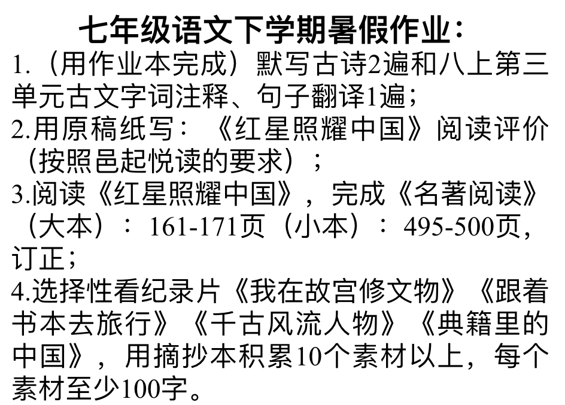

>古诗  [56](_image/56.jpg) [57](_image/57.jpg) [58](_image/58.jpg) [59](_image/59.jpg) [60](_image/60.jpg)

### 数学暑假作业 ###
* 数学同步训练七年级【下】

### 英语暑假作业 ###
1. 看一部英文电影：《爱丽丝梦游仙境》(八上M7学习需要）
2. 学唱一首英文歌 ：I’m Your Angel （旋律优美，语速较慢，歌词简单且正能量）
3. 推荐一个宝藏的英语学习频道： YouTube英语课堂（抖音）
4. 完成一份英语手抄报，要求：
	1. 用A4纸做、主题鲜明、图文并茂；
	2. 规定主题（四选一）：
		1. 假期计划；
		2. 未来生活；
		3. 旅游经历；
		4. 肢体语言。
5. 完成7个week的喜悦阅读（每个week含8个篇章➕1篇作文）；
6. 翼课网听说训练十份。

### 地理暑假作业 ###
七年级地理暑假作业
1. 绘制中国省级行政区域图（A4纸）
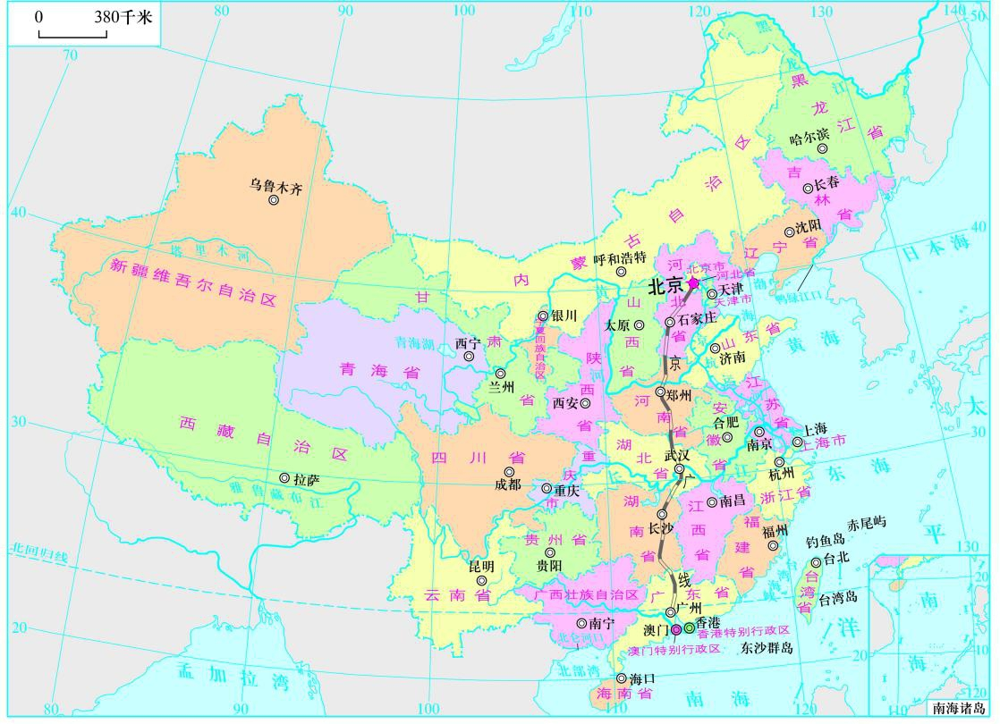
2. 背诵我国34个省级行政区的全称、简称和行政中心
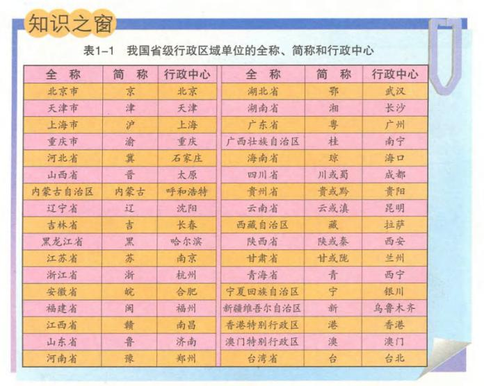

### 历史暑假作业 ###
* 四选一：
	1. 思维导图（七年级）
	2. 环保历史文物模型（一个）
	3. 我的家庭史（采访家人，整理采访内容，形成家庭历史发展报告）
	4. 去5个班唱一首5分钟以内歌，历史老师录视频

### 生物暑假作业 ###
1. 必做：绘制七下前六章的思维导图，每个单元做一章
	>7.20-7.27绘制第一章、7.28-8.3绘制第二章、8.4-8.10绘制第三章、8.11-8.17绘制第四章、8.18-8.24绘制第五章、8.25-8.31绘制第六章  
	用A4纸，写上班别、姓名、学号，六张订一起，开学交进行评比；  
	有时间的同学预习八上剩下知识点。
2. 课外实践作业3选1，必须认真完成
	1. 亲自去家附近的菜市场，认识不同的生物（可阅读八年级的书籍并进行分类）和观察是否有“三无产品”，最后把所看的写下来，字数100字左右；
	2. 阅读一本与生物相关的书籍，例如《物种起源》、《生物学的故事》、《自私的基因》等，写一篇300字的读后感；
	3. 整理七年级做生物练习所遇到过的常错题。

### 政治暑假作业 ###
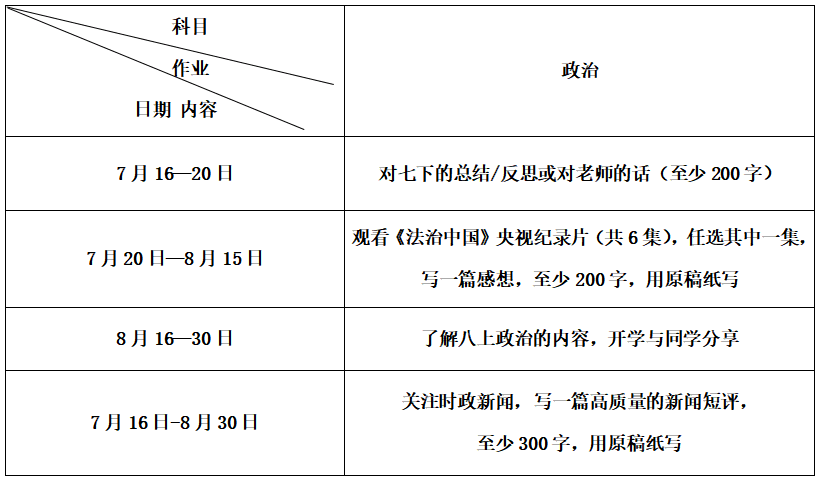

## 第19周周末作业 ##

### 语文周末作业 ###
* 6月29日周末作业17，复习第1，2单元字词文言，现代文阅读知识点。
* 6月30日高分突破第六单元试卷（分层次做前后面），复习3，4单元。
* 7月1号号独立完成期末试卷。剩余时间自主复习，整理笔记。

### 数学周末作业 ###
* 《期末复习》和《单元分层自测》全部并订正。

### 英语周末作业 ###
* 复习学案（四）、（五）、（六）。不写听力。

### 地理周末作业 ###
* 《一黄二白》3张卷子。学导练配套的黄卷《期末过关训练》一张，上午发下去的白卷两张《复习学案四》和《期末》。简称《一黄二白》。

### 历史周末作业 ###
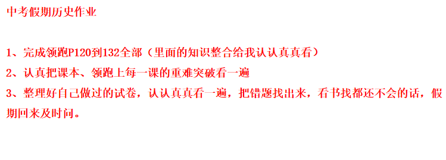

### 生物周末作业 ###
* 没作业，带好资料复习。

### 政治周末作业 ###
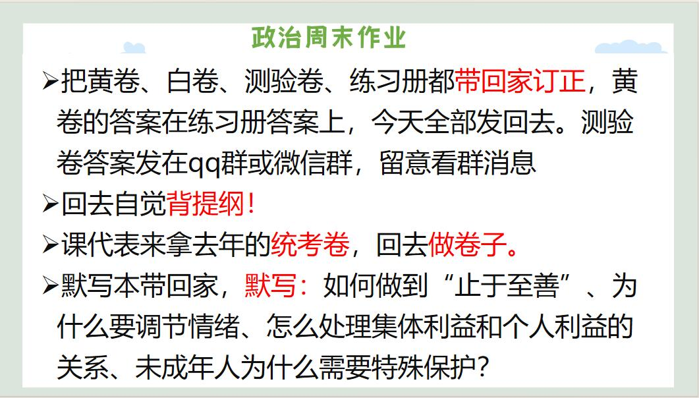

## 第18周周末作业 ##

### 语文周末作业 ###
1. 按今天讲的方法修改一篇之前的作文。
2. 完成周末作业十五。

### 数学周末作业 ###
* 期末复习（一）
	* 周日晚上收
* 期中卷
	* 周一第八节收

### 英语周末作业 ###
1. 完成复习卷M3-M6内容 
2. 完成白卷期末复习卷作文和听力部分[文件](https://cmsz002.github.io/other/homework)，周日看群自行订正 
3. 背诵M1-M6单词短语（参考高分突破），下周抽查

### 地理周末作业 ###
* 学导练极地地区：86-90页。
	* 下周开启复习和试卷刷题模式，请你们周末回去调整好学习状态。

### 历史周末作业 ###
* 完成期末复习学案三的大题全部，写在卷子上

### 生物周末作业 ###
* 生物月考卷
	* 周一第八节统一对答案，周一晚上收起

### 政治周末作业 ###

## 第17周周末作业 ##

### 语文周末作业 ###
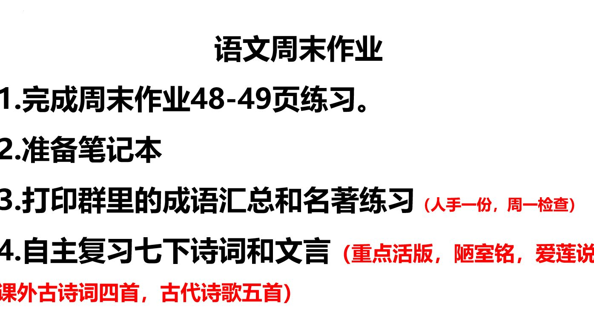

### 数学周末作业 ###
* 导学案P132~133

### 英语周末作业 ###
1. 完成分层m12u3和模块提升
2. 完成翼课网和口语易
3. 下周三口语考试，抓紧时间复习口语卷

### 地理周末作业 ###
* 复习学案（期中）

### 历史周末作业 ###
* 复习学案（期中）
	* 大题用一张大纸写。
	* 周日回来收。

### 生物周末作业 ###
* 完成八年级《金榜》练习册P10-P11
	* 都要订正

### 政治周末作业 ###
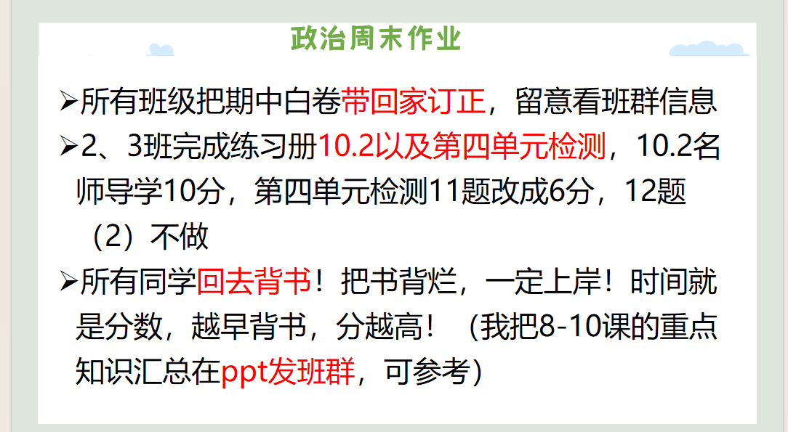

## 端午作业 ##

### 语文端午作业 ###
1. 下周故事主题是《如果文物会说话》，请课代表安排相关同学写稿讲故事。
2. 完成复习学案五，订正。周一晚收上来

### 数学端午作业 ###
1. 复习学案（五）
2. 复习学案（六）

### 英语端午作业 ###
1. 翼课网1套，口语易1套
2. 完成高分突破M11U1/U2/U3
* 以下对号入座
	* 没完成上周翼课网，抄P113的AB开头单词，4英1中
	* 没背完三篇课文：赏卷子两张
	* 第一小组：小组活动失败，除了李昊天，其他三位同学用课堂练习本写30条祈使句（不可重复）

### 地理端午作业 ###
* 复习学案（三）

### 历史端午作业 ###
1. 预习第21课，完成领跑P101知识梳理，把P101到102重难突破第二点写在书上。
2. 完成P105到109的第三单元总结。

### 生物端午作业 ###
1. 完成八年级《金榜》练习册P7-8➕P10的1-5，都要订正
2. 完成七下《金榜》配套试卷“单元质量评价四”，要订正，写好班别姓名，回来当晚课代表收起

### 政治端午作业 ###
1. 完成期中白卷的所有大题
2. 练习册10.1全部
* 分值第9题（1）2分

## 第15周周末作业 ##

### 语文周末作业 ###
* 无

### 数学周末作业 ###
1. 《导学案》P116~117
2. 《课时分层作业》P61

### 英语周末作业 ###
1. 分层M10U2
2. 翼课网
3. 下星期内背五篇课文

### 地理周末作业 ###
* 无作业
	* 因为是六一儿童节，是你们的节日，祝你们节日快乐！

### 历史周末作业 ###
1. 课后精练P26到27全部
2. 预习19课
3. 完成《领跑作业本》P91

### 生物周末作业 ###
* 练习册P3的：1-5、7
* P4的：9
* 预习作业练习册P5-6
	* 都要订正
	* 练习册和教材还没有的同学下周要准备好了

### 政治周末作业 ###
* 《同步导学与优化训练》P74~77
	* 名师导学（1）8分 （2）6分
	* 第9题8分

## 第14周周末作业 ##

### 语文周末作业 ###
* 复习学案（期中）

### 数学周末作业 ###
* 导学案第九章章末复习

### 英语周末作业 ###
1. 分层M9U2
2. 翼课网
3. 《喜阅》P91~99（可以周日回来写）

### 地理周末作业 ###
* 老老实实完成学导练美国部分
	* 已经布置过了，周日晚修收。我要改。

### 历史周末作业 ###
* 完成课后精练P25的6道选择题
* 预习第十八课，完成领跑P87到88知识梳理

### 生物周末作业 ###
* 《金》配套试卷单元质量评价（三）剩余的题。

> 1. 还没准备好人教版初中生物学八年级上册教材的同学，下周必须要准备好了，可购买／打印／借用。
> 2. 对应八年级的练习册《金榜学案》书店也有了，要注意是八年级全一册的，所以一定要保管好，整个八年级都要用，下图是练习册封面，需要留意图片箭头指向的地方
> 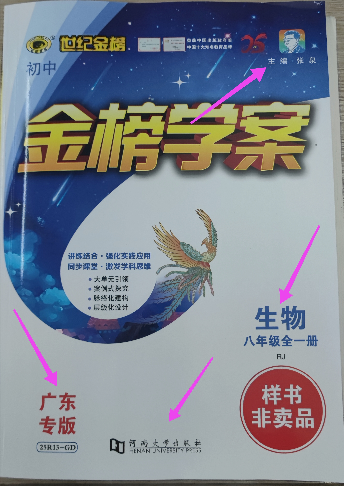

### 政治周末作业 ###
* 练习册第三单元检测全部
	* 下周回来测验第三单元，请大家做好复习工作

## 第13周周末作业 ##

### 语文周末作业 ###
* 周末作业（十一）

### 数学周末作业 ###
* 导学案98、99页
* 课时分层作业52页

### 英语周末作业 ###
1. 翼课网
2. 视频上传（具体要求请看班群）

### 地理周末作业 ###
* 继续完成周三发的那张复习学案（二）的后面两道大题。
* 学导练的美洲概述49-53页。
	* 周日晚上收学导练。

### 历史周末作业 ###
* 无作业

### 生物周末作业 ###
* 《金榜学案》P62~63

### 政治周末作业 ###
* 《同步导学与优化训练》P62~65
	* 周日晚修2下课收

## 第12周周末作业 ##

### 语文周末作业 ###
* 完成作文

### 数学周末作业 ###
* 《导学案》84~85页

### 英语周末作业 ###
* 口语易

### 生物周末作业 ###
* 完成练习册P57、58
	* 都要订正

### 历史周末作业 ###
1. 预习第16课
2. 完成领跑P80知识梳理，并且把P81重难突破第一点抄到书本上

### 政治周末作业 ###
* 《同步》P58~P61
	* 名师导学分值4分，6分
	* 第9题（2）10分改6分
	* 晚修2下课收

### 地理周末作业 ###
* 第八章过关训练
	* 写1-30题选择题和32题大题，31题不用写。

## 五一作业 ##

### 语文五一作业 ###
* 请以《我做到了》为题，写一篇文章
	* 要求：①文体自选（诗歌除外）。  
②500字以上。  
③文中不能出现考生的姓名和所在学校名称。（写在作文本上，保质保量）
* （二）高分突破试卷单元三（写在答题卡也可以在试卷上，丢了试卷的同学尽快找别人的复印）

### 数学五一作业 ###
* 课时分层作业36页、37页、38页
* 导学案73页

### 英语五一作业 ###
1. 高分突破M7U3和模块写作训练
2. 分层M7U3和模块巩固提升
3. 翼课网

### 生物五一作业 ###
1. 先完成练习册P49、P54的1-5
2. 再完成P9-10；P30-32；P50-52
* 都要订正

### 历史五一作业 ###
* 课后精练第12、13课
* 预习第14课，完成领跑P71到72页全部
* 第二单元思维导图

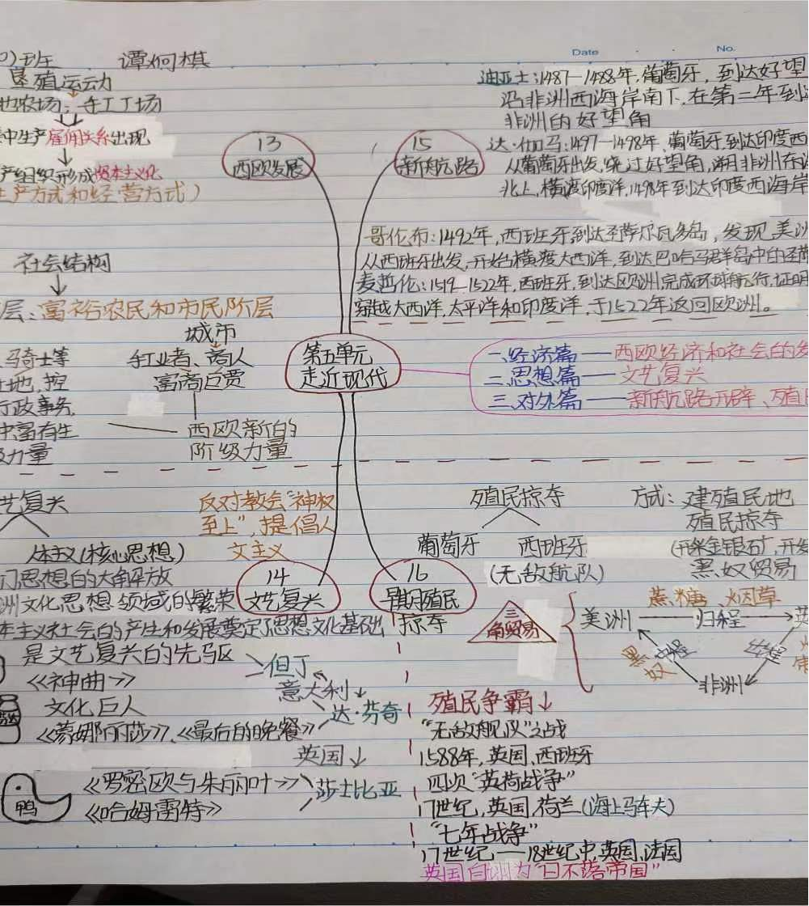

### 政治五一作业 ###
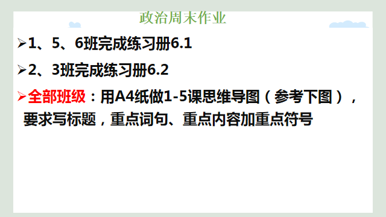
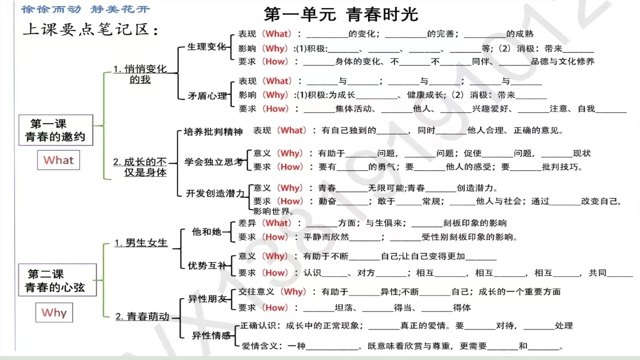

### 地理五一作业 ###
* 完成学导练配套的试卷：期中过关训练。
	* 全部写完。
	* 假期回来收试卷检查没写的人。

## 笫9周周末作业 ##

### 语文周末作业 ###
* **复习**

### 数学周末作业 ###
* 课本第五章章末复习（35~38页）
* 做导学案错题

### 英语周末作业 ###
* 期中专项复习P4.5 P8.9（一~五）

### 生物周末作业 ###
* 同学们周末结合书本、练习册、白卷进行复习，范围是到心脏（包括心脏）

### 历史周末作业 ###
1. 画6-11课思维导图（A4）
2. 复习领跑，历史书，早读晚诵本，课后精练
3. 历史老师赠言：**考试加油**

### 政治周末作业 ###

### 地理周末作业 ###
* 地理自主复习，没有书面作业

## 第8周周末作业 ##

### 语文周末作业 ###
* 完成高分突破第二单元测试卷
* 复习：七下1-3单元的古诗文(木兰诗、孙权劝学、卖油翁、4首课外古诗)
* 默写字词：第1−13课
* 文言文阅读：《孙权劝学》《卖油翁》二选一所以都要复习字词加句子翻译（以上都是考试范围）
	* 作文不用写，讲故事暂停第十一周开始

### 数学周末作业 ###
* 22-23试卷
	* (6,7,21题不写)

### 英语周末作业 ###
1. 分层M5U1
2. 高分突破M5U2
3. 翼课网

### 生物周末作业 ###
* 练习册P40、41、42、43剩下的题，要订正，同时也是周末作业

### 历史周末作业 ###
* 把历史书,课后精练,早读晚诵本,领跑作业本带回家复习
* 用一张A4纸画第一单元思维导图(周日晚回来收)

### 政治周末作业 ###

### 地理周末作业 ###
* **复习!!!**

## 4月4日-4月6日清明作业 ##

### 语文清明作业 ###
1. 上传《〈骆驼祥子〉 阅读评论》到“邑起共读”
2. 试卷(一)1～12 试卷(二)1～12 16～19

### 数学清明作业 ### 
* 导学案66页～67页
* 课时分层作业32页
* 5分钟小测21页～26页

### 英语清明作业 ###
1. 喜阅：11页，18页，46页，47页
2. 翼课网

### 地理清明作业 ###
* 学导练配套的卷子第七章，全部写完，红笔改正。

### 历史清明作业 ###
* 《课后精练》1页～9页(订正)

### 生物清明作业 ###
* 《金榜学案》37页-38页，都要订正

### 政治清明作业 ###

* 《同步导学与优化训练》31页～36页

## 第6周周末作业 ##

### 语文周末作业 ###
* 《周末作业》P11  
* 航海日记200～300字  
* 《高分突破》P35～36阅读题  

### 数学周末作业 ###
* 《导学案》第7章复习

### 英语周末作业 ###
1. 高分突破 M6U1  
2. 翼课网  
3. 口语易

### 生物周末作业 ###
* 《金榜学案》P27 P28 P33

### 历史周末作业 ###
* 预习第9课  
* 完成《领跑》P44  
* 抄《领跑》P45 重难突破（1）

### 政治周末作业 ###
1. 《同步导学》5.2  
* 名师导学分值：2 4

### 地理周末作业 ###
《学导练》P29～33

## 第5周周末作业 ##

### 语文周末作业 ###
1. 周末作业四  
2. 随笔  
3. 讲故事主题“内向性格的力量”（安排好相关同学做准备）

### 数学周末作业 ###
* 五分钟小测 14-20页

### 英语周末作业 ###
1. 作文本写试卷上作文  
2. 翼课网  
3. 一张试卷(作文不写)

### 历史周末作业 ###
1. 预习第八课  
2. 完成《领跑》知识梳理

### 政治周末作业 ###
  
* 自己选择其中一个观点去找资料，下周上课阐述观点，也可以小小地反驳对方观点

### 生物周末作业 ###
* 练习册P23-24，都要订正

### 地理周末作业 ###
* 学导练大本24-28页

## 笫4周周末作业 ##

### 地理周末作业 ###

* 学导练大本，还是南亚部分，19-23页，有点多，积极写。 

### 生物周末作业 ###

1. 练习册P16-P18剩余的题“，都要订正  
2. 下周上课需要用到零食，请同学们带一包自己爱吃的袋装零食回来，上课用

### 美术 ###

* 美术课代表组织班级的同学报名 可单人/双人合作共同完成 是整个班级的任务 你们是一个team 请团结起来共同面对现实

### 周末历史作业 ###

1. 完成领跑P25到28页第一单元总结并订正  
2. 预习第6课北宋的政治，完成领跑P29到30页知识梳理  
3. 把领跑P30页重难突破抄到书上，下星期会讲到。

### 政治周末作业 ###

### 语文周末作业 ###

1. 《周末作业》2  
2. 故事:理智追星

### 数学周末作业 ###

* 导学案第六章复习

### 英语周末作业 ###

1. 翼课网
