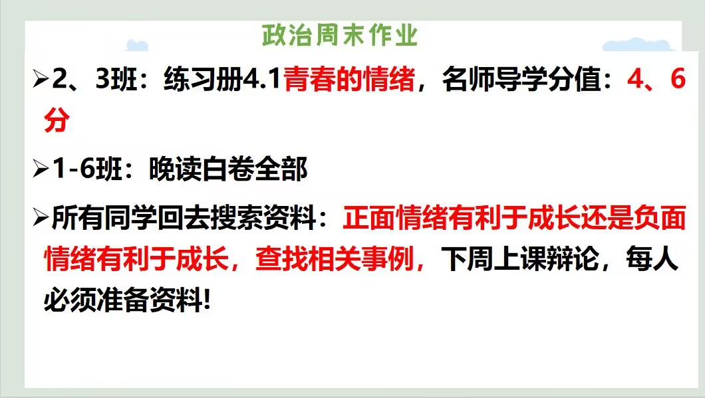
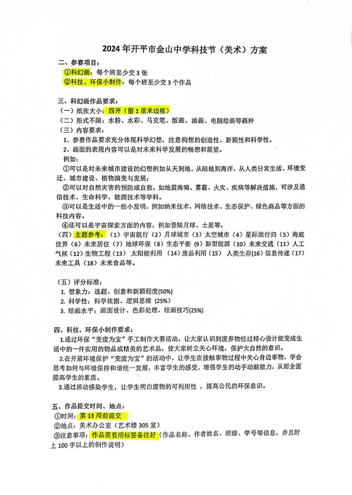
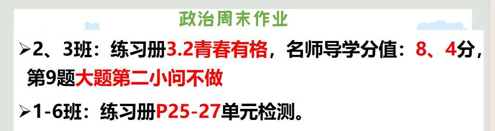

<h1>作业</h1>

## 第6周周末作业 ##

### 语文周末作业 ###
	* 《周末作业》P11  
	* 航海日记200～300字  
	* 《高分突破》P35～36阅读题  

### 数学周末作业 ###
	* 《导学案》第7章复习

### 英语周末作业 ###
1. 高分突破 M6U1  
2. 翼课网  
3. 口语易

### 生物周末作业 ###
* 《金榜学案》P27 P28 P33

### 历史周末作业 ###
* 预习第9课  
* 完成《领跑》P44  
* 抄《领跑》P45 重难突破（1）

### 政治周末作业 ###
1. 《同步导学》5.2  
* 名师导学分值：2 4

### 地理周末作业 ###
《学导练》P29～33

## 第5周周末作业 ##

### 语文周末作业 ###
1. 周末作业四  
2. 随笔  
3. 讲故事主题“内向性格的力量”（安排好相关同学做准备）

### 数学周末作业 ###
* 五分钟小测 14-20页

### 英语周末作业 ###
1. 作文本写试卷上作文  
2. 翼课网  
3. 一张试卷(作文不写)

### 历史周末作业 ###
1. 预习第八课  
2. 完成《领跑》知识梳理

### 政治周末作业 ###
  
* 自己选择其中一个观点去找资料，下周上课阐述观点，也可以小小地反驳对方观点

### 生物周末作业 ###
* 练习册P23-24，都要订正

### 地理周末作业 ###
* 学导练大本24-28页

## 笫4周周末作业 ##

### 地理周末作业 ###

* 学导练大本，还是南亚部分，19-23页，有点多，积极写。 

### 生物周末作业 ###

1. 练习册P16-P18剩余的题“，都要订正  
2. 下周上课需要用到零食，请同学们带一包自己爱吃的袋装零食回来，上课用

### 美术 ###

* 美术课代表组织班级的同学报名 可单人/双人合作共同完成 是整个班级的任务 你们是一个team 请团结起来共同面对现实

### 周末历史作业 ###

1. 完成领跑P25到28页第一单元总结并订正  
2. 预习第6课北宋的政治，完成领跑P29到30页知识梳理  
3. 把领跑P30页重难突破抄到书上，下星期会讲到。

### 政治周末作业 ###

### 语文周末作业 ###

1. 《周末作业》2  
2. 故事:理智追星

### 数学周末作业 ###

* 导学案第六章复习

### 英语周末作业 ###

1. 翼课网
