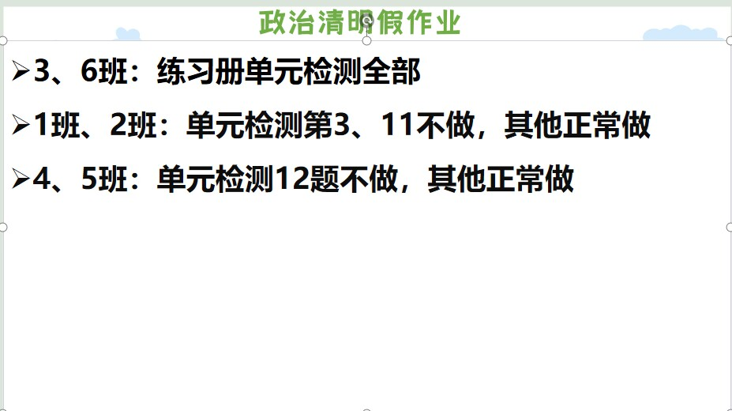

<h1>作业</h1>

## 第十周周末作业 ##
### 语文周末作业 ###
* 反思（400字及以上）
* 周末作业（八）

### 数学周末作业 ###
* 导学案70~71页
	* 周六晚上7点检查
	* 没写记名

### 英语周末作业 ###
1. 分层M7U1
2. 书本划线句子翻译（在书上写）

### 生物周末作业 ###
* 反思

### 历史周末作业 ###
* 完成领跑P62知识梳理以及P63综合探究
	* 自行对好答案
	* 周六晚上收上来

### 政治周末作业 ###
* 反思

### 地理周末作业 ###
* 反思

## 笫九周周末作业 ##

### 语文周末作业 ###
* **复习**

### 数学周末作业 ###
* 课本第五章章末复习（35~38页）
* 做导学案错题

### 英语周末作业 ###
* 期中专项复习P4.5 P8.9（一~五）

### 生物周末作业 ###
* 同学们周末结合书本、练习册、白卷进行复习，范围是到心脏（包括心脏）

### 历史周末作业 ###
1. 画6-11课思维导图（A4）
2. 复习领跑，历史书，早读晚诵本，课后精练
3. 历史老师赠言：**考试加油**

### 政治周末作业 ###

### 地理周末作业 ###
* 地理自主复习，没有书面作业

## 第八周周末作业 ##

### 语文周末作业 ###
* 完成高分突破第二单元测试卷
* 复习：七下1-3单元的古诗文(木兰诗、孙权劝学、卖油翁、4首课外古诗)
* 默写字词：第1−13课
* 文言文阅读：《孙权劝学》《卖油翁》二选一所以都要复习字词加句子翻译（以上都是考试范围）
	* 作文不用写，讲故事暂停第十一周开始

### 数学周末作业 ###
* 22-23试卷
	* (6,7,21题不写)

### 英语周末作业 ###
1. 分层M5U1
2. 高分突破M5U2
3. 翼课网

### 生物周末作业 ###
* 练习册P40、41、42、43剩下的题，要订正，同时也是周末作业

### 历史周末作业 ###
* 把历史书,课后精练,早读晚诵本,领跑作业本带回家复习
* 用一张A4纸画第一单元思维导图(周日晚回来收)

### 政治周末作业 ###

### 地理周末作业 ###
* **复习!!!**

## 4月4日-4月6日清明作业 ##

### 语文清明作业 ###
1. 上传《〈骆驼祥子〉 阅读评论》到“邑起共读”
2. 试卷(一)1～12 试卷(二)1～12 16～19

### 数学清明作业 ### 
* 导学案66页～67页
* 课时分层作业32页
* 5分钟小测21页～26页

### 英语清明作业 ###
1. 喜阅：11页，18页，46页，47页
2. 翼课网

### 地理清明作业 ###
* 学导练配套的卷子第七章，全部写完，红笔改正。

### 历史清明作业 ###
* 《课后精练》1页～9页(订正)

### 生物清明作业 ###
* 《金榜学案》37页-38页，都要订正

### 政治清明作业 ###

* 《同步导学与优化训练》31页～36页

## 第6周周末作业 ##

### 语文周末作业 ###
* 《周末作业》P11  
* 航海日记200～300字  
* 《高分突破》P35～36阅读题  

### 数学周末作业 ###
* 《导学案》第7章复习

### 英语周末作业 ###
1. 高分突破 M6U1  
2. 翼课网  
3. 口语易

### 生物周末作业 ###
* 《金榜学案》P27 P28 P33

### 历史周末作业 ###
* 预习第9课  
* 完成《领跑》P44  
* 抄《领跑》P45 重难突破（1）

### 政治周末作业 ###
1. 《同步导学》5.2  
* 名师导学分值：2 4

### 地理周末作业 ###
《学导练》P29～33

## 第5周周末作业 ##

### 语文周末作业 ###
1. 周末作业四  
2. 随笔  
3. 讲故事主题“内向性格的力量”（安排好相关同学做准备）

### 数学周末作业 ###
* 五分钟小测 14-20页

### 英语周末作业 ###
1. 作文本写试卷上作文  
2. 翼课网  
3. 一张试卷(作文不写)

### 历史周末作业 ###
1. 预习第八课  
2. 完成《领跑》知识梳理

### 政治周末作业 ###
  
* 自己选择其中一个观点去找资料，下周上课阐述观点，也可以小小地反驳对方观点

### 生物周末作业 ###
* 练习册P23-24，都要订正

### 地理周末作业 ###
* 学导练大本24-28页

## 笫4周周末作业 ##

### 地理周末作业 ###

* 学导练大本，还是南亚部分，19-23页，有点多，积极写。 

### 生物周末作业 ###

1. 练习册P16-P18剩余的题“，都要订正  
2. 下周上课需要用到零食，请同学们带一包自己爱吃的袋装零食回来，上课用

### 美术 ###

* 美术课代表组织班级的同学报名 可单人/双人合作共同完成 是整个班级的任务 你们是一个team 请团结起来共同面对现实

### 周末历史作业 ###

1. 完成领跑P25到28页第一单元总结并订正  
2. 预习第6课北宋的政治，完成领跑P29到30页知识梳理  
3. 把领跑P30页重难突破抄到书上，下星期会讲到。

### 政治周末作业 ###

### 语文周末作业 ###

1. 《周末作业》2  
2. 故事:理智追星

### 数学周末作业 ###

* 导学案第六章复习

### 英语周末作业 ###

1. 翼课网
